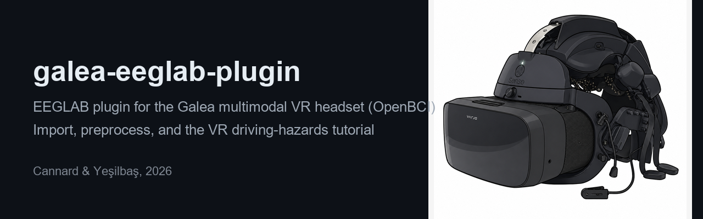
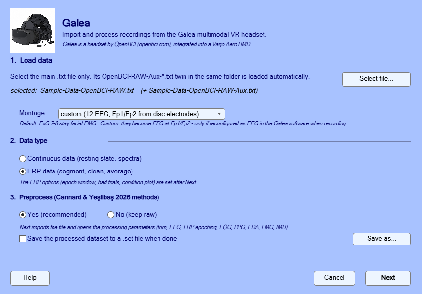

# galea-eeglab-plugin



EEGLAB plugin for importing and preprocessing recordings from the Galea
multimodal VR headset (OpenBCI) — dry-electrode EEG integrated into a Varjo Aero
head-mounted display.

Cedric Cannard, 2026. GPL-3.0 (see LICENSE).

## Install

**From the EEGLAB extension manager (recommended):** in EEGLAB, *File > Manage
EEGLAB extensions*, search for **galea**, and install.

**From a release:** download the zip from the
[releases page](https://github.com/amisepa/galea-eeglab-plugin/releases), unzip
it into `eeglab/plugins/`, and restart EEGLAB. Cloning this repository into
`eeglab/plugins/` works too. Either way, a single **Galea** entry appears in the EEGLAB menu
bar. It opens the main window (file, montage, data type, preprocess yes/no);
**Next** imports the recording and opens the processing parameters, one
section per signal, and **Run** there starts the processing.

Dependencies: none for import/EEG processing. The optional PPG (heart-rate)
branch uses the [BrainBeats](https://github.com/sccn/brainbeats) plugin; the
Galea window finds and installs it automatically if missing.

## The two windows

**Main window** (menu *Galea*): select the recording, the montage, the data
type (continuous or ERP), and whether to preprocess. **Next** imports the file
and opens the processing parameters.



**Processing parameters**: one section per signal, every signal ticked by
default. Below the EEG options sits a section for the chosen data type:
Continuous (2nd ASR pass, power spectra) or ERP (epoch window, the events to
epoch around, bad-trial rejection, the conditions to plot). **Run** starts the processing. Shown with the
settings of Cannard & Yeşilbaş (2026).


## What it does

Standard EEGLAB import and cleaning routines assume a gel-based, high-density
montage and a nominal sampling rate. Galea recordings break three of those
assumptions, and this plugin handles each one.

**`pop_galea`** (the menu entry):

- **Load** — reads the plain-text files written by the Galea/OpenBCI GUI. A
  recording is a pair (`OpenBCI-RAW-<date>.txt` with EEG/EOG/EMG +
  `OpenBCI-RAW-Aux-<date>.txt` with PPG/EDA/IMU); select the main file and its
  Aux twin is picked up automatically. The multiplexed streams are split into
  EEG, EOG, EMG, PPG, EDA and IMU (nothing discarded — non-EEG streams stay in
  `EEG.etc.galea`), the sampling rate is estimated from both the device and the
  PC timestamps and snapped to the board's nominal rate (the two clocks disagree
  — RawPCTimestamp gives ~249.95 Hz and RawDeviceTimestamp ~247.72 Hz, so
  neither is trustworthy alone; the difference propagates into every latency
  and wavelet frequency downstream),
  both the stock 10-channel montage and the 12-channel custom montage (the two
  EMG disc electrodes reconfigured as Fp1/Fp2) are supported, and the numeric
  trigger codes are converted into readable event labels for the VR driving
  paradigm.
- **Process** (second window; all optional, per-signal switches, every signal
  on by default):
  - *Trim* — drops the head and tail of the recording around the first and
    last event, for the EEG **and** all auxiliary signals, each at its own
    sampling rate.
  - *Downsample* — keep the detected rate, or divide it by 2 or 4 (integer
    ratios avoid resampling artefacts).
  - *Minimum-phase causal bandpass* — keeps the pre-stimulus period free of
    post-stimulus leakage. A zero-phase filter smears post-stimulus activity
    backwards in time and can manufacture anticipatory effects that are
    entirely artefactual; only needed for pre-stimulus analyses.
  - *Polarity correction for the prefrontal disc electrodes*, which the Galea
    amplifier sometimes records with inverted leads (custom montage).
  - *Bad-channel detection tuned for a sparse dry montage* — `clean_rawdata`
    assumes enough neighbours for its correlation criterion to be meaningful;
    with 12 electrodes it does not. This uses a sliding-window combination of
    amplitude outliers and inter-channel correlation, with explicit thresholds.
  - *ASR* with remove (default) or reconstruct mode; for continuous data, an
    optional second, stricter pass after ICA (threshold 10) and a power
    spectrum of the cleaned recording.
  - *ICA* with ocular-component removal (eyes-open tasks only).
  - *ERP epoching* (ERP data only): epoch window, the events to epoch
    around, bad-trial rejection (mean, median or Grubbs outlier criterion),
    and any number of conditions overlaid in one plot (20% trimmed mean with
    its 95% confidence interval, one color each, plus each condition's
    single-trial ERP image).
  - *Other signals*, in the same window: EOG with blink detection, PPG
    through BrainBeats with RR artefact correction and HRV features, EDA
    tonic/phasic, EMG envelope, IMU magnitude.

## Tutorial

From a raw Galea recording to an ERP, step by step with screenshots:
**[TUTORIAL.md](TUTORIAL.md)**. A runnable script version of the same steps,
with more parameter detail, is [`tutorial_galea.m`](tutorial_galea.m) — open it
in MATLAB and run section by section.

## Sample data

Two sample recordings ship in `sample_data/`:

- **`Sample-Data-OpenBCI-RAW.txt` (+ Aux)** — epoched ERP recording (subject
  sub-005, trials 1-98 of the VR collision study), for trying the full
  preprocessing pipeline.
- **`Sample-Data-OpenBCI-RAW-RestingState.txt` (+ Aux)** — 5.5-minute
  continuous resting-state recording (250 Hz, no markers), for trying the
  import on a continuous dataset.

## Scripting and `eegh`

Every step the windows run is written to the EEGLAB history, so after a GUI
run `eegh` prints commands you can paste into a script:

```matlab
EEG = pop_galea_import('montage','custom', 'filename','Sample-Data-OpenBCI-RAW.txt', 'filepath', pwd);
EEG = pop_galea_preprocess(EEG, 'locut',0.5, 'hicut',30, 'causal',true, 'asr',100, 'ica',true);
EEG = galea_erp_workflow(EEG, 'epochwin',[-3 3], 'epochevents',{'no_tire_pop','tire_pop'}, ...
    'rejtrials',true, 'plotconds',{'no_tire_pop','tire_pop'});
```

`EEG = pop_galea;` opens the main window from the command line.
`pop_galea_preprocess(EEG)` with no options opens the processing parameters
window on a dataset that is already loaded. The windows and the scripts take
the same option names (see `help pop_galea_preprocess`).

## Also included

- `find_badTrials.m` — epoch rejection by amplitude and high-frequency
  residual, using a mean-based outlier criterion.
- `galea_trimci.m` — trimmed mean and its Tukey-McLaughlin confidence
  interval (Wilcox's `trimci`; matches `scipy.stats.mstats.trimmed_mean_ci`),
  used by `galea_plot_conditions.m` for the condition overlay.

## Citation

If you use this plugin, please cite:

Cannard, C., & Yeşilbaş, D. (2026). *Reactive and predictive processes during
unpredictable driving hazards in virtual reality: an exploratory brain and body
study with multimodal neurophysiological monitoring.* The VR driving paradigm
this plugin was built for is replicated by
[github.com/amisepa/galea-vr-driving-hazards](https://github.com/amisepa/galea-vr-driving-hazards).

## License

GPL-3.0. Anyone redistributing the code (including commercial users) must
release their modifications under the same terms; academic use is unaffected.
