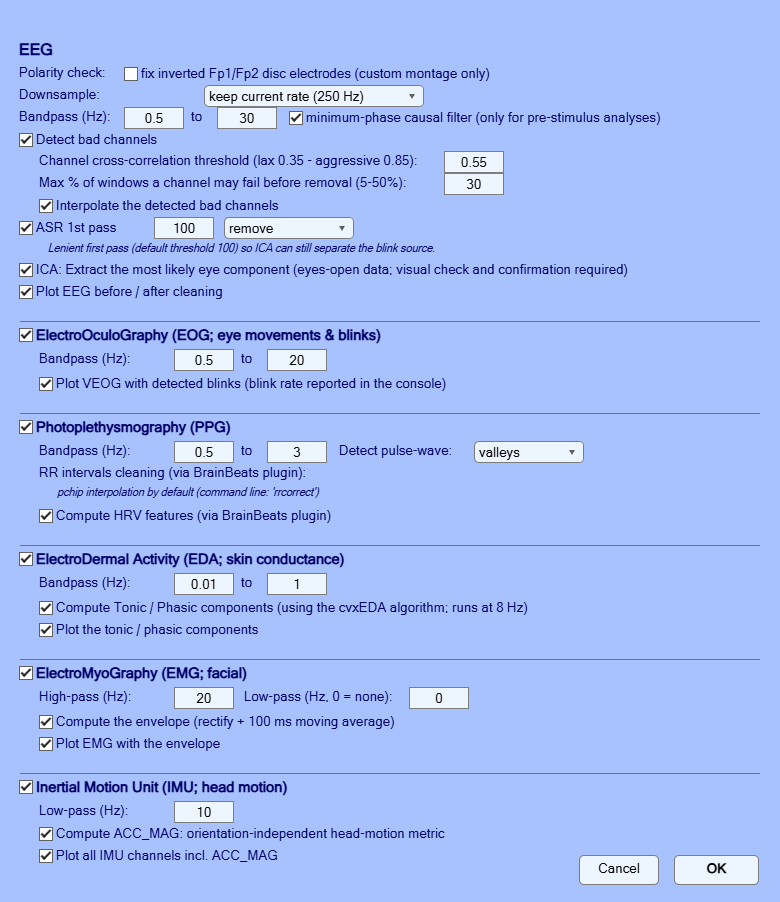

<!-- Part of the galea-eeglab-plugin repository. GPL-3.0 (c) 2026 Cedric Cannard. -->

# Tutorial: from a raw Galea recording to an ERP

This walkthrough takes a raw recording from the Galea multimodal headset
(OpenBCI) to a condition-average ERP, entirely through the EEGLAB plugin. It
takes about ten minutes, and everything shown works on the sample data shipped
in [`sample_data/`](sample_data/). A
runnable script version of the same steps, with more detail on each parameter,
is [`tutorial_galea.m`](tutorial_galea.m)
— open it in MATLAB and run it section by section.

### 1. Install

Copy (or clone) `galea_eeglab_plugin/` into `eeglab/plugins/` and restart
EEGLAB. A single **Galea** entry appears in the EEGLAB menu bar.

You also need the
[BrainBeats](https://github.com/amisepa/BrainBeats) plugin if you want the PPG
branch (heart rate); the plugin finds it for you if it is installed.

### 2. About the files

A Galea recording is a **pair** of plain-text files written by the Galea /
OpenBCI GUI, and both must sit in the same folder:

```
OpenBCI-RAW-<date>.txt        EEG, EOG, EMG      <- you select this one
OpenBCI-RAW-Aux-<date>.txt    PPG, EDA, IMU      <- found automatically
```

Select the main file only; the plugin picks up its Aux twin itself.

### 3. Load a recording

**Menu: Galea** (this opens one window that does everything, top to bottom).

1. Click **Select file...** and choose the main `OpenBCI-RAW-*.txt` file. The
   plugin checks the Aux twin immediately; nothing is imported yet — importing
   (a slow step) happens when you press **Run**, and a status line under the
   file name reports progress ("Importing data and converting to EEGLAB
   format..." / "Data imported successfully into EEGLAB").
2. Choose the montage:
   - **default** — the stock 10-EEG layout. The two spare ExG channels stay as
     EMG (kept in `EEG.etc.galea.EMG`).
   - **custom** — 12 EEG, where the two EMG disc electrodes become Fp1/Fp2.
     Only use this if you actually reconfigured those electrodes as EEG in
     the Galea software *when recording* — otherwise you would be relabelling
     facial EMG as brain data.
3. Pick the **data type**: **Continuous** (resting state; adds the 2nd-ASR-pass
   and spectra options) or **ERP** (segmented; adds the epoch window,
   bad-trial rejection and condition list — the list is filled by a marker
   scan that runs when ERP is selected).
4. Choose **Preprocess: Yes/No** (default **Yes**). With Yes, pressing **Run**
   imports the file first, then opens the preprocessing options window
   (EEG, PPG, EDA, EMG, IMU) before any cleaning starts.


The import splits the multiplexed streams into EEG, EOG, EMG, PPG, EDA and IMU
(non-EEG streams are kept in `EEG.etc.galea`, nothing is discarded), sets the
sampling rate by estimating it from both the device and the PC timestamps and
snapping to the board's nominal rate — the two clocks disagree (RawPCTimestamp
gives ~249.95 Hz, RawDeviceTimestamp ~247.72 Hz), and that difference propagates
into every latency downstream — and converts the numeric trigger codes into
readable event labels when the file comes from the VR driving paradigm.

### 4. Process

With **Preprocess: Yes** selected in the main window, pressing **Run** imports
the file and then opens the preprocessing options. Every section below is
optional and each can be switched off individually.



- **Trim (all signals)** — removes data before the first event and after the
  last event, plus a pad. Applies to the EEG *and* all auxiliary signals. `0`
  keeps everything.
- **EEG**
  - *Downsample* — a dropdown that lists the detected rate first ("keep
    current rate"), then rate/2 and rate/4 (dividing avoids resampling
    artefacts at non-integer ratios), then common fixed rates.
  - *Bandpass* — 0.5–30 Hz for ERP work.
  - *Causal minimum-phase filter* — tick this for any **pre-stimulus**
    analysis. A zero-phase filter smears post-stimulus activity backwards in
    time and can manufacture an anticipatory effect that is entirely
    artefactual. Leave unticked for post-stimulus-only analyses.
  - *Bad-channel detection* — tuned for a sparse dry montage (12 electrodes),
    where `clean_rawdata`'s correlation criterion is unreliable. Defaults:
    correlation threshold 0.55, at most 30% of windows tolerated. The two
    threshold fields grey out when detection is off. **Interpolate the
    detected bad channels** sits below the thresholds; tick it to replace the
    flagged channels.
  - *ASR (artifact subspace reconstruction)* — default threshold 100 in
    **remove** mode (flagged segments deleted; any event markers inside them
    are listed in the command window). Use *reconstruct* if you must keep every
    trial. A lenient first pass is deliberate: it deletes only the worst
    segments while leaving ocular activity, so ICA can separate the blink
    source cleanly.
  - *ICA, remove the ocular component* — eyes-open tasks only.
  - *ASR pass after ICA* — optional second, stricter pass; its threshold and
    mode live in the main window under the **Continuous** data type (default
    off), since it only applies to continuous data.
  - Tick **Plot EEG before / after** to see what was done.
- **Peripheral signals** — click **Set EOG / PPG / EDA / EMG / IMU options...**
  for the heart-rate, EDA, EMG and IMU branches, each with its own parameters
  and plot option.


Click **Run**.

### 5. Epoch

Processing runs on continuous data; epoching and ERPs come from the standard
EEGLAB menus. Eyeball the cleaned signal first (**Plot > Channel data and
scroll**), then **Tools > Extract epochs**: cut `[-1.5 1.5]` s around the event
of interest (e.g. `tire_pop` — the tyre blowout). Leave *baseline removal*
off, so the pre- and post-stimulus periods stay comparable.

### 6. Average and plot

Compute the condition average with **Tools > Average across files or across
channels > Average over trials** (or, in the script version,
`pop_select` + `mean(SET.data, 3)`), then plot with
**Plot > Channel data and scalp maps > Channel ERPs**.

### 7. Where to go next

- Epoch rejection by amplitude and high-frequency residual:
  `functions/find_badTrials.m`
- The full study pipeline this plugin was built for:
  [github.com/amisepa/galea-vr-driving-hazards](https://github.com/amisepa/galea-vr-driving-hazards)
- A continuous (resting-state, no markers) sample recording for trying the
  import on a continuous dataset:
  [`sample_data/`](sample_data/)

## 8. Spectra of a continuous recording

The resting-state sample (`sample_data/Sample-Data-OpenBCI-RAW-RestingState.txt`,
5.5 min, no markers) is for trying the plugin on continuous data. Load it with
the **Galea** menu, preprocess with the causal filter OFF (nothing to
anticipate in resting state; a 1-70 Hz band is enough for spectra), then plot
the spectra:

```matlab
figure; pop_spectopo(EEG, 1, [], 'EEG', 'freq', [6 10 22], 'freqrange',[1 70], 'electrodes','off');
```

or through the GUI: **Plot > Channel properties > Spectra** (set the frequency
range to 1-70 Hz). What to look for: the eyes-closed alpha peak near 10 Hz,
theta around 6 Hz, beta around 22 Hz; a flat spectrum above ~40 Hz is normal
for dry electrodes.

> **TODO**: screenshot of the spectra figure here.
